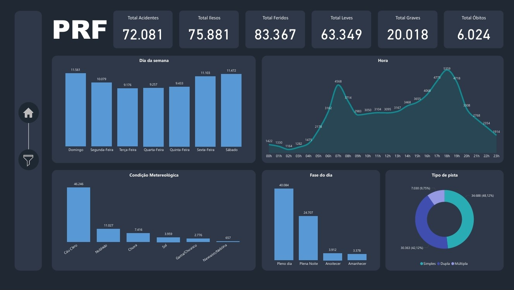
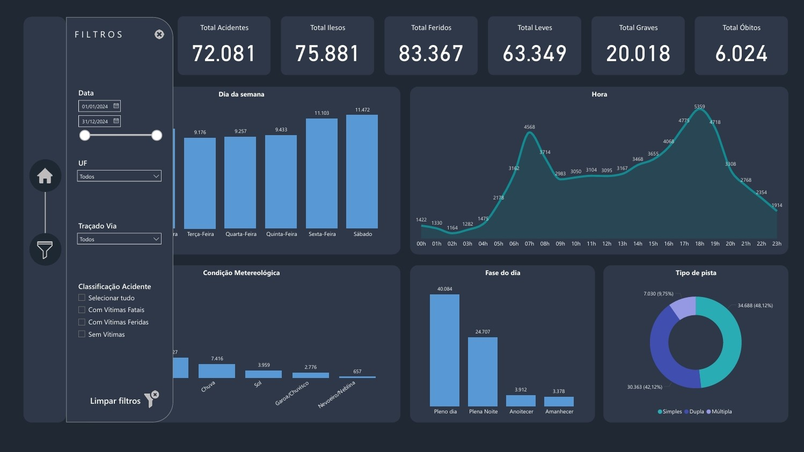

# PRF - Acidentes de Trânsito 2024
OBJETIVO: Mostrar estatísticas gerais sobre os acidentes e suas relações com as condições metereológicas, fases do dia, tipo de pista e etc.

# Onde encontrar os dados?
Link: https://www.gov.br/prf/pt-br/acesso-a-informacao/dados-abertos/dados-abertos-da-prf

Arquivo .csv: Documento CSV de Acidentes 2024 (Agrupados por ocorrência)

## Dashboard

## Dashboard com o painel de filtros

